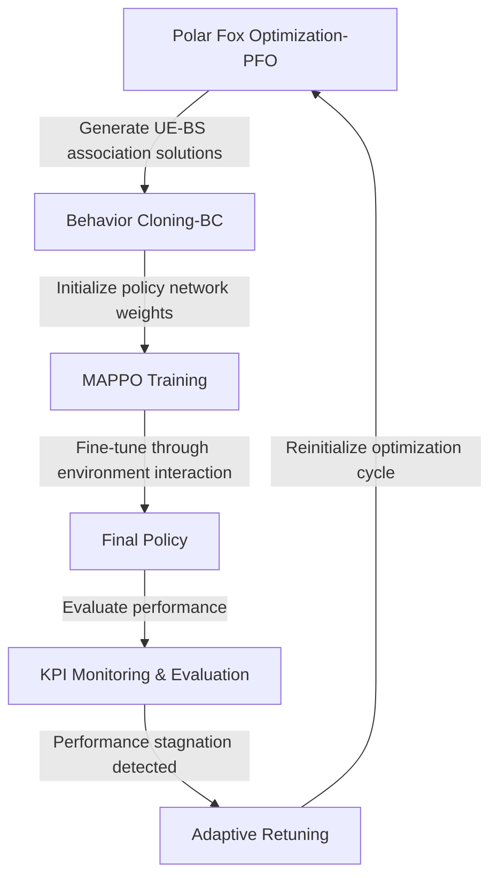

# Hybrid MARL–Polar Fox Optimization for User Association and Load Balancing in telecommunication Networks

This project introduces a hybrid artificial intelligence framework that combines Multi-Agent Reinforcement Learning(MAPPO) and Polar Fox Optimization (PFO) to optimize user association and load balancing in heterogeneous wireless networks.

---

## Overview

This project investigates the use of hybrid intelligence for resource management in next-generation telecommunication systems. 

Emerging 6G networks are expected to support ultra-dense deployments,massive device connectivity, highly mobile users, and diverse service requirements.  

However, traditional user association approaches often struggle under dynamic network conditions characterized by user mobility, fluctuating traffic demand, and heterogeneous base station deployments. 

Under such conditions, conventional user association techniques, such as connecting users to the geographically nearest base station or the one with the strongest received signal strength, often result in imbalanced network utilization especially in tiered-deployment with varying base-station power.

Some context for this can be:
- A large number of users clustering around a particular area, such as a stadium for watching the world cup, a concert or a shopping mall, casues the immediate nearby base stations to become overloaded while neighboring cells remain underutilized.
- Variations in traffic demand mean that some users require significantly more resources than others. Treating all users uniformly can result in unfair resource allocation and reduced user satisfaction.
- In heterogeneous networks comprising macro cells and small cells, users often associate with macro base stations because of stronger signal strength, even when nearby small cells have sufficient capacity and signal strength to serve them more efficiently.
- Users moving through the network may repeatedly switch between base stations, leading to frequent handovers, increased signaling overhead, and degraded Quality of Service (QoS).
    
To this end, the key challenges to be addressed include:
- Uneven traffic distribution,
- Cell congestion,
- Frequent handovers,
- User mobility,
- Fair allocation of radio resources,
- Balancing throughput and quality of service

To address these challenges and ensure proper network delivery, this framework integrates:

- Multi-Agent Proximal Policy Optimization (MAPPO) for adaptive decision-making,
- Polar Fox Optimization (PFO) for global search and initialization,
- A custom telecommunication simulation environment,
- Interactive experimentation and visualization through Streamlit.

This framework jointly optimizes user association and load balancing decisions with the objective of improving throughput, fairness, resource utilization, and network stability under dynamic operating conditions.

---

## Key Features

- Hybrid MAPPO–PFO optimization framework
- Custom multi-agent telecommunication environment
- Heterogeneous network support (macro and small cells)
- User mobility simulation
- SINR-based user association
- Resource Block (RB) allocation
- Load balancing mechanisms
- Handover management
- Adaptive metaheuristic retuning
- Behavior cloning pretraining support
- Checkpointing and experiment recovery
- Comparative evaluation of multiple metaheuristic algorithms
- Interactive Streamlit dashboard for experimentation

---

## System Architecture
This layout below illustrates the hybrid training structure of the implemented framework:



## Technologies Used

### Reinforcement Learning
- Ray RLlib
- MAPPO
- PyTorch

### Optimization
- Polar Fox Optimization (PFO)
- Multiple benchmark metaheuristics

### Simulation
- Gymnasium
- NumPy
- Pandas

### Visualization
- Streamlit
- Plotly

---

## Methodology

### Environment

A custom Gymnasium-compatible multi-agent environment was developed to simulate heterogeneous 6G wireless networks.

The environment models:

- User Equipment (UEs),
- Macro and Small Base Stations,
- User mobility using the Random Waypoint Model,
- SINR calculations,
- Resource allocation through resource blocks and demand-aware propotional-fair resource allocation,
- Association decisions,
- Network KPIs including throughput, fairness, SIMR achieved, load distribution, and handover statistics.

For the state/observation space, each UE agent (ue_0...ue_{N-1}) receives a vector of :
 - Normalized SINR vector
 - PRB load fractions
 - Normalized demand
 - Last step throughput

For the action space, each UE independently chooses an integer in [0, num_bs). 
- Action 0 means disconnect (associated_bs = None);
- Actions 1..num_bs-1 map to BS indices 0..num_bs-2 (i.e., action value a maps to BS a-1)

Rewards


### Hybrid Training

The framework follows a three-stage optimization process:

1. Polar Fox Optimization (PFO) explores the solution space and generates high-quality UE–BS association mappings.
2. Behavior Cloning (BC) learns an initial policy from PFO-generated solutions, providing MAPPO with an informed starting point.
3. MAPPO fine-tunes the policy through environment interaction, learning adaptive association strategies that generalize beyond the initial demonstrations.

This combination leverages the global search capability of metaheuristics and the adaptive learning capability of reinforcement learning.

Adaptive retuning mechanisms allow re-optimization when network performance stagnates.

---

## Performance Metrics
The framework evaluates performance using:

- Throughput: Total network data rate achieved.
- Jain's Fairness Index: Fairness of resource allocation among users.
- User Connectivity Ratio: Percentage of users successfully served.
- Load Distribution: Degree of balance across base stations.
- Handover Efficiency: Ability to maintain connectivity while minimizing unnecessary handovers.
- Episode Reward: Overall optimization objective achieved during training.
---

## Streamlit Dashboard

The project includes an interactive dashboard that enables users to:

- Configure experiments in terms of number of users and base stations,
- Select optimization algorithms,
- Compare algorithm performance,
- Monitor KPIs in real time,
- Visualize training progress,
- Explore network behavior interactively.

---
## Results

Experiments compare the proposed MAPPO–PFO framework against:

- Standalone MAPPO
- Polar Fox Optimization
- Additional metaheuristic baselines

Evaluation focuses on throughput, fairness, load balancing, and handover performance under varying user densities and mobility conditions.

Results show that the proposed MARL-PFO framework opperates better in terms of speed of convergence, network performance metrics amd policy refinement.

---
## Installation

Clone the repository:

```bash
git clone https://github.com/Agnes-101/hybrid_marl_pfo_training.git
cd hybrid_marl_pfo_training
```

Create a virtual environment:

```bash
python -m venv .venv
```

Activate it:

### Linux / WSL

```bash
source .venv/bin/activate
```

### Windows

```bash
.venv\Scripts\activate
```

Install dependencies:

```bash
pip install -r requirements.txt
```

---

## Running the Streamlit Dashboard

```bash
streamlit run streamlit_app/streamlit_app.py
```

---

## Configuration

Default experiment settings can be modified through configuration files located in:

```text
configs/
```

Parameters include:

- Network topology,
- Number of users,
- Training iterations,
- MARL hyperparameters,
- Metaheuristic settings,
- Early stopping criteria.

---

## Future Improvements

Potential extensions include:

- RLModule migration for newer RLlib APIs,
- Transformer-based MARL policies,
- Dynamic spectrum sharing,
- Energy-efficient optimization,
- Federated multi-agent learning,


---

## Author

**Agnes**

Interests:
- Artificial Intelligence
- Reinforcement Learning
- Data Science
- Cloud and Data Engineering